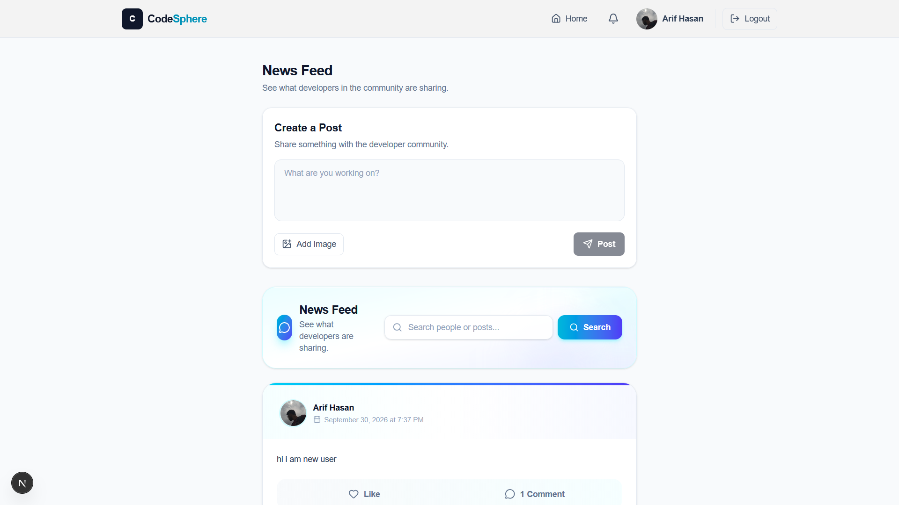
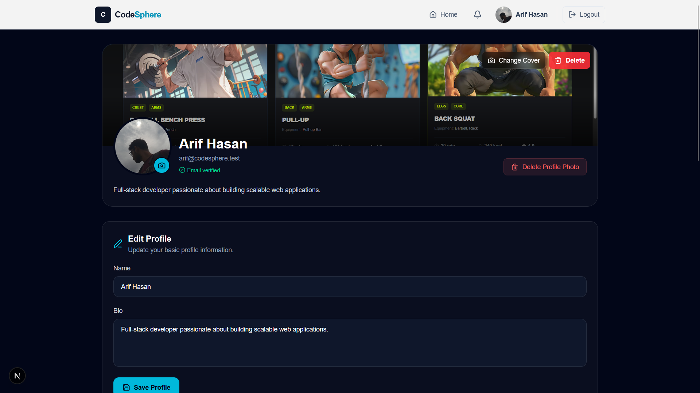
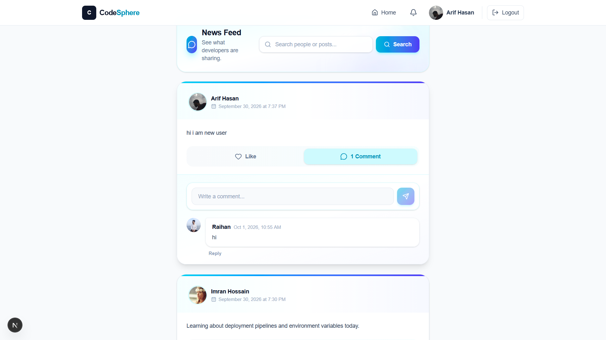
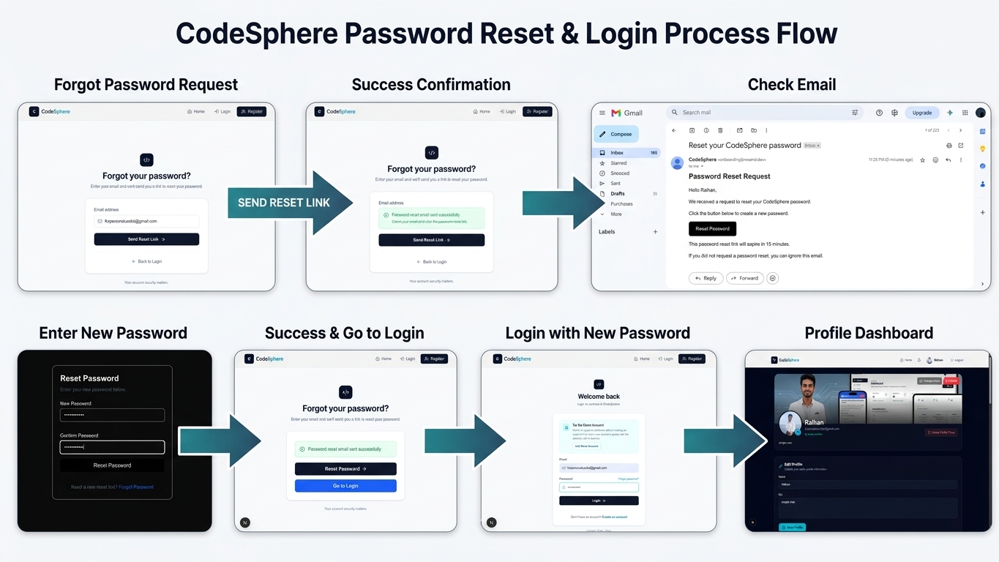

# 🌐 CodeSphere

**CodeSphere** is a modern full-stack developer community platform where developers can create posts, interact with other developers, manage their profiles, discover other developers, and receive real-time updates.

The project was built with a **production-oriented full-stack architecture** using Next.js, NestJS, Prisma, PostgreSQL, WebSockets, Cloudinary, and Resend.

<p align="center">
  <a href="https://code-sphere-swart.vercel.app/">
    
  </a>
  <a href="https://github.com/raihankabir1952/CodeSphere">
    
  </a>
</p>

---

# ✨ Features

## 🔐 Authentication & Security

* User registration and login
* JWT-based authentication
* Protected API routes
* Persistent authentication state
* Email verification
* Resend verification email
* Forgot password functionality
* Password reset with email token/OTP
* Server-side ownership validation
* Request validation with NestJS `ValidationPipe`
* Whitelist and non-whitelisted request protection
* Production CORS configuration

---

## 👤 Developer Profiles

* Public developer profiles
* Personal profile management
* Update name and bio
* Upload profile picture
* Upload cover photo
* Delete profile picture
* Delete cover photo
* View user posts
* View profile statistics
* Search developers by name
* Navigate directly from posts to author profiles

---

## 📝 Posts

* Create posts
* Create posts with optional images
* Edit your own posts
* Delete your own posts
* Cloudinary image uploads
* Paginated news feed
* Load more posts
* Search posts
* Author profile navigation
* Server-side ownership protection

---

## ❤️ Likes & Comments

* Like/unlike posts
* Real-time like updates
* Create comments
* Edit comments
* Delete comments
* Nested comment replies
* Edit/delete replies
* Comment count
* Reply count
* Cascade deletion for comments and replies

---

## 🔔 Real-Time Features

CodeSphere uses **Socket.IO + WebSockets** for real-time communication.

Current real-time features include:

* Online user presence
* Offline user detection
* Real-time like updates
* Real-time comment events
* User-specific notification events
* Socket rooms for individual users

---

# 🛠️ Technology Stack

## Frontend

<p>
  
</p>

* Next.js
* React
* TypeScript
* Tailwind CSS
* Axios
* Lucide React
* Socket.IO Client

---

## Backend

<p>
  
</p>

* NestJS
* TypeScript
* Prisma ORM
* PostgreSQL
* Node.js
* REST API
* Socket.IO / WebSockets
* JWT Authentication

---

## Cloud Services & Deployment

<p>
  
</p>

| Service    | Purpose              |
| ---------- | -------------------- |
| Vercel     | Frontend deployment  |
| Render     | Backend deployment   |
| Supabase   | PostgreSQL database  |
| Cloudinary | Image storage        |
| Resend     | Transactional emails |

---

# 🏗️ Project Architecture

```text
CodeSphere
│
├── frontend/
│   ├── app/
│   ├── components/
│   ├── context/
│   ├── lib/
│   └── ...
│
└── backend/
    ├── src/
    │   ├── auth/
    │   ├── users/
    │   ├── posts/
    │   ├── likes/
    │   ├── comments/
    │   ├── notifications/
    │   ├── email/
    │   └── prisma/
    └── ...
```

### Request Flow

```text
                    ┌─────────────────────┐
                    │   Next.js Frontend  │
                    │      Vercel         │
                    └──────────┬──────────┘
                               │
                    Axios / REST API
                               │
                               ▼
                    ┌─────────────────────┐
                    │   NestJS Backend    │
                    │       Render        │
                    └──────────┬──────────┘
                               │
             ┌─────────────────┼─────────────────┐
             │                 │                 │
             ▼                 ▼                 ▼
        JWT Auth          Prisma ORM        Socket.IO
                               │                 │
                               ▼                 ▼
                         PostgreSQL        Real-Time Events
                         (Supabase)
             
             ┌─────────────────┴─────────────────┐
             │                                   │
             ▼                                   ▼
        Cloudinary                             Resend
      Image Storage                        Transactional Email
```

---

# 🗄️ Database Design

CodeSphere uses **PostgreSQL with Prisma ORM**.

Main entities:

```text
User
 │
 ├── Posts
 ├── Likes
 └── Comments

Post
 │
 ├── Author
 ├── Likes
 └── Comments

Comment
 │
 └── Replies
```

The database uses:

* Primary keys
* Unique constraints
* Foreign keys
* Relational mappings
* Cascading deletes
* Timestamp fields
* Unique user/post like constraints

For example, a user can only like the same post once.

---

# 🔒 Security & Authorization

Security was considered throughout the backend instead of relying only on frontend restrictions.

### Authentication

```text
User
 ↓
Login
 ↓
JWT Access Token
 ↓
Frontend Storage
 ↓
Axios Authorization Header
 ↓
NestJS Auth Guard
 ↓
Protected Controller
```

### Ownership Protection

For resources such as posts, the backend verifies ownership before allowing modifications.

```text
Request
   ↓
Authenticated User
   ↓
Find Resource
   ↓
Check Owner
   ↓
Allowed / Forbidden
```

This prevents a user from editing or deleting another user's post simply by modifying an ID in the request.

---

# ⚡ Real-Time System

CodeSphere uses **Socket.IO** for real-time communication.

### Current events

```text
User connects
     ↓
Register socket
     ↓
Join personal user room
     ↓
Broadcast online status
     ↓
Listen for:
   ├── Like updates
   ├── Comment events
   └── Notifications
     ↓
User disconnects
     ↓
Broadcast offline status
```

The backend maintains a mapping between users and their active socket connections and uses user-specific rooms for targeted events.

---

# ☁️ Image Upload System

Images are handled through **Cloudinary** instead of storing image files directly on the application server.

Current upload categories:

```text
Cloudinary
│
├── codesphere/avatars
│
└── codesphere/posts
```

Supported uploads include:

* Profile pictures
* Cover photos
* Post images

The database stores the resulting secure image URL.

---

# 📧 Email System

CodeSphere uses **Resend** for transactional email delivery.

Email functionality includes:

* Account verification
* Resending verification email
* Password reset
* Password reset token/OTP delivery

## ⚠️ Important Email Limitation

> ### 🚨 Resend Testing / Domain Limitation
>
> During development and initial deployment, Resend's **testing environment has restrictions on recipient email addresses**. In particular, testing can be limited to the email address associated with the verified/testing setup.
>
> Because CodeSphere is designed for production use, the final production email workflow should use a **verified sending domain** in Resend. Once the domain is verified and the production sending setup is configured, the application can send transactional emails to normal user email addresses without relying on the development/testing limitation.
>
> **This limitation belongs to the email provider's testing configuration, not to CodeSphere's authentication architecture.**

This was an important production consideration while implementing registration verification and password reset flows.

---

# 🧩 Challenges & Solutions

Building CodeSphere involved several practical full-stack and deployment challenges.

## 1. Prisma 7 + PostgreSQL Adapter

### Challenge

The project uses a newer Prisma setup where the PostgreSQL adapter is required for the database client configuration.

### Solution

Configured Prisma with the PostgreSQL adapter and connected it through the NestJS `PrismaService`.

```text
NestJS
   ↓
PrismaService
   ↓
Prisma PostgreSQL Adapter
   ↓
Supabase PostgreSQL
```

This keeps database access centralized inside the backend.

---

## 2. Prisma Client Missing During Render Deployment

### Challenge

The application worked locally, but the production Render build initially failed because the generated Prisma Client was not available during the build process.

### Solution

The production build was changed to generate Prisma Client before compiling NestJS:

```bash
prisma generate && nest build
```

This ensured the generated Prisma client was available in the production build.

---

## 3. Supabase Connection Pooling

### Challenge

Production PostgreSQL connections need to be handled carefully when the backend is deployed on a cloud platform.

### Solution

Configured separate database connection URLs for application usage and direct database operations:

```text
DATABASE_URL
DIRECT_URL
```

The Supabase pooler is used for application connections while the direct connection is available for Prisma database operations where required.

---

## 4. Production CORS

### Challenge

The frontend and backend run on different production domains.

```text
Vercel Frontend
        │
        ▼
Render Backend
```

Without correct CORS configuration, browser requests would be blocked.

### Solution

The backend reads the frontend URL from an environment variable:

```env
FRONTEND_URL=your-production-frontend-url
```

NestJS then uses that value for CORS configuration.

---

## 5. WebSocket Production URL

### Challenge

The Socket.IO client worked locally using:

```text
http://localhost:3001
```

but production required a different backend URL.

### Solution

The frontend WebSocket URL was moved into an environment variable:

```env
NEXT_PUBLIC_SOCKET_URL=your-production-backend-url
```

The same frontend code can therefore work in both development and production.

---

## 6. Vercel TypeScript Build Error

### Challenge

The application worked during development, but Vercel's production build detected missing fields in the frontend `Comment` type.

The backend returned fields such as:

```text
userId
parentId
replies
```

while the frontend type did not initially describe all of them.

### Solution

The frontend type was updated to accurately represent the backend response.

This demonstrated an important difference between:

```text
Development Runtime
        vs
Production Type Checking
```

A successful local run does not always guarantee a successful production build.

---

## 7. Nested Comments & Replies

### Challenge

Supporting replies requires comments to reference other comments while still belonging to the same post.

### Solution

A self-referencing Prisma relation was used:

```text
Comment
  │
  ├── parent
  │
  └── replies[]
```

This allows comments to have replies while maintaining relational integrity.

---

## 8. Ownership-Based Post Security

### Challenge

Frontend buttons alone cannot prevent users from sending unauthorized API requests.

### Solution

Ownership checks were implemented inside the backend service.

```text
Authenticated User
        ↓
Find Post
        ↓
Compare authorId
        ↓
Same User?
   ┌────┴────┐
  Yes        No
   ↓          ↓
Allow      Forbidden
```

This ensures authorization is enforced at the API level.

---

## 9. Online User Presence

### Challenge

Knowing which users are currently connected requires maintaining WebSocket connection state.

### Solution

The notification gateway maintains a user-to-socket mapping and broadcasts:

```text
userOnline
userOffline
onlineUsers
```

This allows the frontend to maintain a live online-user list.

---

# 📧 Authentication Flow

```text
Registration
     ↓
Create User
     ↓
Generate Verification Token
     ↓
Send Verification Email
     ↓
User Verifies Email
     ↓
Login
     ↓
JWT Access Token
     ↓
Authenticated Application
```

### Password Reset

```text
Forgot Password
       ↓
Enter Email
       ↓
Generate Reset Token
       ↓
Send Email
       ↓
Verify Token
       ↓
Set New Password
```

---

# 🚀 Getting Started

## 1. Clone the Repository

```bash
git clone https://github.com/raihankabir1952/CodeSphere.git

cd CodeSphere
```

---

## 2. Frontend Setup

```bash
cd frontend

npm install
```

Create:

```text
.env.local
```

Add:

```env
NEXT_PUBLIC_API_URL=http://localhost:3001
NEXT_PUBLIC_SOCKET_URL=http://localhost:3001
```

Run:

```bash
npm run dev
```

Frontend:

```text
http://localhost:3000
```

---

## 3. Backend Setup

Open another terminal:

```bash
cd backend

npm install
```

Create:

```text
.env
```

Example:

```env
DATABASE_URL=your_database_url
DIRECT_URL=your_direct_database_url

JWT_SECRET=your_jwt_secret

FRONTEND_URL=http://localhost:3000

RESEND_API_KEY=your_resend_api_key

CLOUDINARY_CLOUD_NAME=your_cloudinary_cloud_name
CLOUDINARY_API_KEY=your_cloudinary_api_key
CLOUDINARY_API_SECRET=your_cloudinary_api_secret
```

Generate Prisma Client:

```bash
npx prisma generate
```

Run the backend:

```bash
npm run start:dev
```

Backend:

```text
http://localhost:3001
```

---

# 🌍 Production Deployment

CodeSphere is deployed using multiple cloud services.

```text
                CodeSphere
                    │
        ┌───────────┴───────────┐
        │                       │
    Frontend                 Backend
     Vercel                  Render
        │                       │
        │                       │
        └──────────┬────────────┘
                   │
                Supabase
               PostgreSQL
                   │
          ┌────────┴────────┐
          │                 │
      Cloudinary          Resend
       Images              Email
```

### Live Frontend

https://codesphere-7tqe0yi1u-raihans-projects-9a4b96c8.vercel.app/

### Live Backend

https://codesphere-backend-3e0p.onrender.com

---

# 🧪 Demo Account

Use the following seeded account to explore the application:

```text
Email: arif@codesphere.test
Password: Test@123456
```

> Demo credentials are provided for testing purposes.

---

# 🖼️ Screenshots

Screenshots can be added here to showcase the application.

### 🏠 News Feed



### 👤 Developer Profile



### 📝 Posts & Comments



### 🔐 Authentication



---

# 📚 Key Learning Outcomes

Through CodeSphere, I gained practical experience with:

* Next.js App Router
* React and TypeScript
* NestJS modular architecture
* REST API development
* JWT authentication
* Authorization and ownership validation
* Prisma ORM
* PostgreSQL database design
* Supabase PostgreSQL
* Database relationships
* Nested relational data
* Pagination
* Search functionality
* File uploads
* Cloudinary
* Transactional email
* Resend
* WebSockets
* Socket.IO
* Real-time events
* Environment variable management
* CORS configuration
* Production deployment
* Vercel
* Render
* Production debugging
* TypeScript production builds

---

# 🔮 Future Improvements

Potential future improvements include:

* Direct messaging between developers
* Developer following system
* Advanced notification center
* Rich text post editor
* Developer skill tags
* Advanced developer discovery
* More real-time collaboration features
* Admin moderation tools
* Improved image optimization
* Activity feed

---

# 👨‍💻 Author

## Raihan Kabir

**Full Stack Developer**

I build modern web applications using technologies such as:

```text
Next.js
React
TypeScript
NestJS
Node.js
PostgreSQL
Prisma
```

### GitHub

https://github.com/raihankabir1952

---

# ⭐ Support

If you find CodeSphere interesting, consider giving the repository a ⭐ on GitHub.
